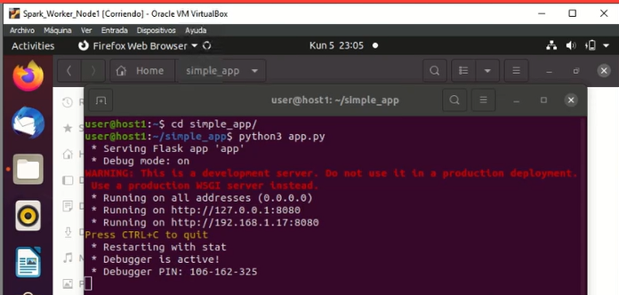
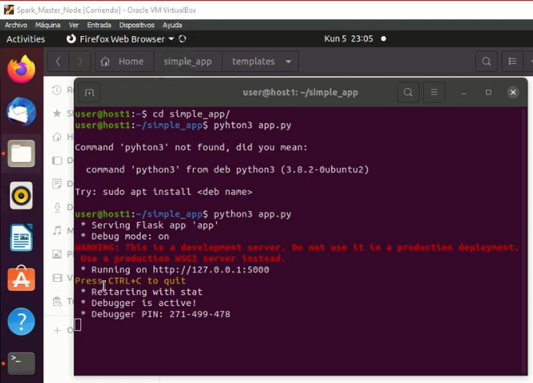
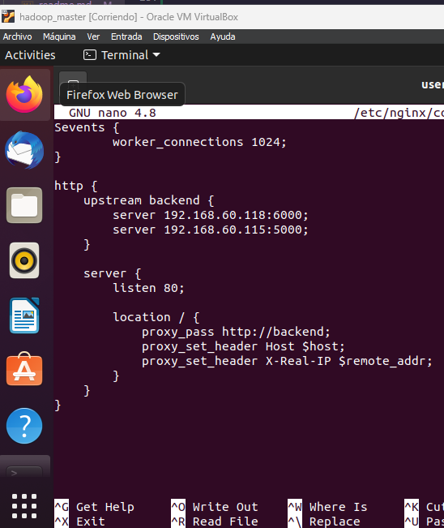
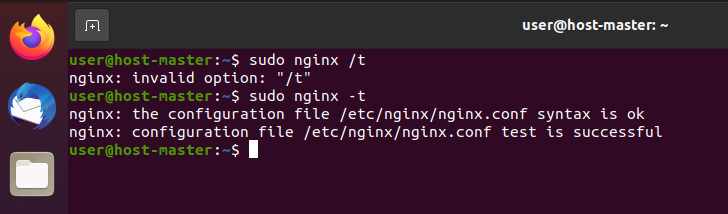
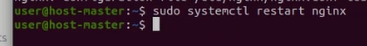
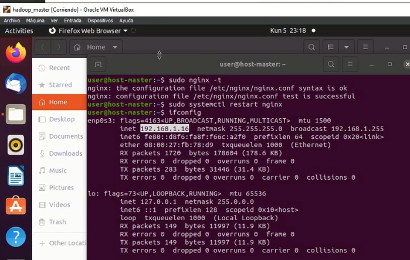
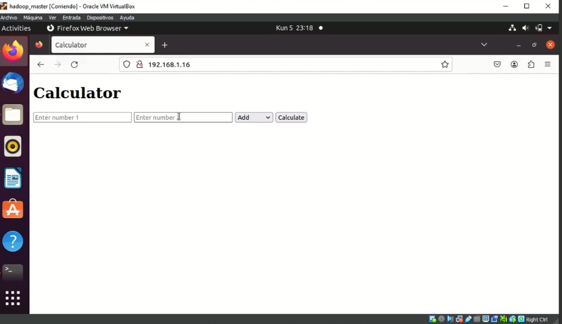
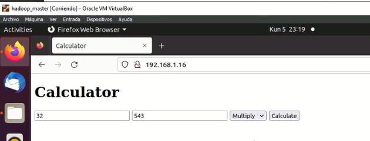
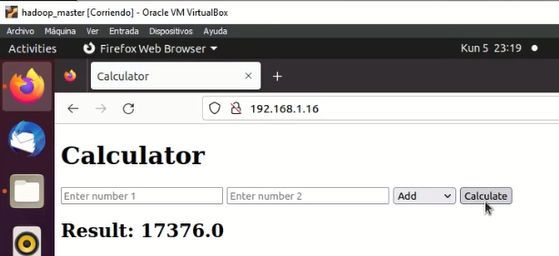

<div align="center">
    <table>
        <theader>
        <tr>
            <th>
            
            </th>
            <th>
            <span style="font-weight:bold;">UNIVERSIDAD LA SALLE</span><br />
            <span style="font-weight:bold;">FACULTAD DE INGENIERÍAS</span><br />
            <span style="font-weight:bold;">DEPARTAMENTO DE INGENIERÍA Y MATEMÁTICAS</span><br />
            <span style="font-weight:bold;">CARRERA PROFESIONAL DE INGENIERÍA DE SOFTWARE</span>
            </th>            
        </tr>
        </theader>
    </table>
</div>

<table>
    <theader>
        <tr>
        <th colspan="2">INFORMACIÓN BÁSICA</th>
        </tr>
    </theader>
    <tbody>
        <tr>
            <td>ALUMNOS:</td>
            <td>Roger Infa Sanchez y Frank Duarte Oruro</td>
        </tr>
        <tr>
            <td>CURSO:</td>
            <td>Computación Distribuida y Paralela</td>
        </tr>
        <tr>
            <td>DOCENTE:</td>
            <td>Renzo Mauricio Rivera Zavala  - rriveraz@ulasalle.edu.pe</td>
        </tr>
        <tr>
            <td>TAREA:</td>
            <td>Sistema de recomendación de Películas Spark </td>
        </tr>
        <tr>
            <td>DESCRIPCION:</td>
            <td>Crear una aplicación web y desplegarla en un Cluster de Aplicaciones con balanceo de carga. La aplicación debería brindar características de “Tolerancia a Fallos” y “Alta Disponibilidad”.
</td>
        </tr>
        <tr>
            <td colspan="2">RECURSOS:</td>
        </tr>
        <tr>
            <td colspan="2">
                <ul>
                <li> Recursos proporcionados por clasroom.
                </ul>
            </td>
        </tr>
    </tbody>
</table>

# Configurar servidores

Primero, deberá instalar Nginx en todos los servidores con el comando

```bash
apt-get install nginx -y
```

Una vez instalado, iniciar el servicio Nginx y habilítelo para que se inicie
al reiniciar el sistema:

```bash
systemctl start nginx
```

```bash
systemctl enable nginx
```

A continuación, deberá configurar ambos servidores de aplicaciones.

En el primer servidor de aplicaciones, elimine el archivo index.html
predeterminado

```bash
rm -rf /usr/share/nginx/html/index.html
```

Ahora creamos nuevo

```bash
nano /usr/share/nginx/html/index.html
```

Aqui es donde ponemos nuestra aplicacion web
Nosotros tulilizamos flask para lanzar nuestra app en un localhost

```bash
- simple_app
    - templates
        - calculator.html
    - app.py
```

El codigo es el siguiente

```python
from flask import Flask, render_template, request

app = Flask(__name__)

@app.route('/', methods=['GET', 'POST'])
def calculator():
    if request.method == 'POST':
        num1 = float(request.form['num1'])
        num2 = float(request.form['num2'])
        operation = request.form['operation']
        result = None

        if operation == 'add':
            result = num1 + num2
        elif operation == 'subtract':
            result = num1 - num2
        elif operation == 'multiply':
            result = num1 * num2
        elif operation == 'divide':
            if num2 != 0:
                result = num1 / num2
            else:
                return "Error: Division by zero"

        return render_template('calculator.html', result=result)

    return render_template('calculator.html')

if __name__ == '__main__':
    app.run(debug=True)
```

# Calculadora Flask

Este es un código en Python que implementa una calculadora web utilizando el framework Flask. La calculadora permite realizar operaciones básicas como suma, resta, multiplicación y división.

## Requisitos

- Python 3.x
- Flask

## Instalación

1. Clona el repositorio o descarga el archivo `calculator.py`.

2. Abre una terminal y navega hasta el directorio donde se encuentra el archivo `calculator.py`.

3. Crea un entorno virtual (opcional pero recomendado):

   ```
   python3 -m venv venv
   source venv/bin/activate
   ```

4. Instala Flask:
   ```
   pip install flask
   ```

## Uso

1. Ejecuta el siguiente comando en la terminal para iniciar el servidor:

   ```
   python calculator.py
   ```

2. Abre un navegador web y visita `http://localhost:5000`.

3. Verás una calculadora web con dos campos de entrada para los números y un menú desplegable para seleccionar la operación.

4. Ingresa los números en los campos de entrada y selecciona la operación deseada.

5. Haz clic en el botón "Calcular" para obtener el resultado de la operación.

6. El resultado se mostrará en la parte inferior de la página.

7. Puedes realizar más cálculos repitiendo los pasos 4-6.

## Detalles de implementación

Este es el codigo:

```python
from flask import Flask, render_template, request

app = Flask(__name__)

@app.route('/', methods=['GET', 'POST'])
def calculator():
    if request.method == 'POST':
        num1 = float(request.form['num1'])
        num2 = float(request.form['num2'])
        operation = request.form['operation']
        result = None

        if operation == 'add':
            result = num1 + num2
        elif operation == 'subtract':
            result = num1 - num2
        elif operation == 'multiply':
            result = num1 * num2
        elif operation == 'divide':
            if num2 != 0:
                result = num1 / num2
            else:
                return "Error: Division by zero"

        return render_template('calculator.html', result=result)

    return render_template('calculator.html')

if __name__ == '__main__':
    app.run(debug=True)
```

El código comienza importando las clases necesarias de Flask. Flask es un framework web ligero y flexible que facilita la creación de aplicaciones web en Python.

A continuación, se crea una instancia de la clase Flask y se asigna a la variable `app`.

Luego, se define una ruta raíz `'/'` y se especifica que acepta tanto solicitudes GET como POST. Esto significa que la ruta se puede acceder tanto al cargar la página como al enviar un formulario.

La función `calculator` se asocia a la ruta raíz y se ejecuta cuando se accede a ella. Si la solicitud es de tipo POST (es decir, se envió un formulario), se obtienen los valores de los números y la operación desde el formulario. Los números se convierten a tipo `float` para permitir cálculos decimales.

A continuación, se realiza la operación correspondiente según el valor de `operation`. Si la operación es la suma, se suma `num1` y `num2`. Si la operación es la resta, se resta `num2` de `num1`, y así sucesivamente. El resultado se asigna a la variable `result`.

Si la operación es la división y `num2` es cero, se devuelve un mensaje de error indicando que no se puede dividir entre cero.

Finalmente, se renderiza la plantilla `calculator.html` y se pasa el resultado como argumento. Si la solicitud es de tipo GET, simplemente se renderiza la plantilla sin pasar ningún resultado.
La plantilla `calculator.html` es la siguiente:

```html
<!DOCTYPE html>
<html>
  <head>
    <title>Calculator</title>
  </head>
  <body>
    <h1>Calculator</h1>
    <form method="POST">
      <input type="text" name="num1" placeholder="Enter number 1" required />
      <input type="text" name="num2" placeholder="Enter number 2" required />
      <select name="operation">
        <option value="add">Add</option>
        <option value="subtract">Subtract</option>
        <option value="multiply">Multiply</option>
        <option value="divide">Divide</option>
      </select>
      <button type="submit">Calculate</button>
    </form>

    
    <h2>Result: {{ result }}</h2>
    
  </body>
</html>
```

Al final del archivo, se verifica si el archivo está siendo ejecutado
directamente y no importado como un módulo. Si es así, se inicia el servidor de
desarrollo de Flask con la opción `debug` habilitada. Guardamos y cerramos el
archivo.
Al ejecutar este es com nos manda en el nodo 1:



Y este es con el otro nodo:



## Configurar un equilibrador de carga de Nginx

A continuación, deberá configurar un servidor equilibrador de carga que distribuya la carga entre ambos servidores de aplicaciones.

```bash
rm -rf /etc/nginx/sites-enabled/default
```

```bash
nano /etc/nginx/conf.d/load-balancing.conf
```

Agregue lo siguiente:

```bash
upstream backend {
    server 192.168.1.17;
    server 192.168.1.18;
}
    server {
    listen 80;
    server_name loadbalancing.example.com;
        location / {
            proxy_redirect off;
            proxy_set_header X-Real-IP $remote_addr;
            proxy_set_header X-Forwarded-For $proxy_add_x_forwarded_for;
        proxy_set_header Host $http_host;
            proxy_pass http://backend;
        }
    }
```

Para el método `Least_conn`:

```bash
upstream backend {
    least_conn;
    server 192.168.1.17;
    server 192.168.1.18;
}
```

Para el metodo método `Ip_hash`:

```bash
upstream backend {
    ip_hash;
    server 192.168.1.17;
    server 192.168.1.18;
}
```

Así quedaría el archivo en la maquina que usaremos como cluster:



Verificamos el Nginx para cualquier error de sintaxis con el siguiente
comando:

```bash
nginx-t
```

Deberia botar algo asi:

```bash
nginx: the configuration file /etc/nginx/nginx.conf syntax is ok
nginx: configuration file /etc/nginx/nginx.conf test is successful
```

Adjuntamos screen



Significa que el programa esta funcionando reiniciamos el nginx con el comando

```bash
sudo systemctl restart nginx
```



Ahora para evaluar los resultados desde el cluster primero vemos la ip con `ifconfig`



Vemos que la ip es `192.168.1.16` y si la ponemos en el buscador, deberia aparecernos la calculadora que hemos creado:



Pára probar la funcionalidad, probaremos



Y luego vemos que si bota el resultado bein.



Video mostranto lo de matando un nodo(que aun funcione la aplicacion)y luego ambos nodo donde ya deja de funcionar la aplicación.
[Video explicativo](pruebamatarnodos.mp4)
